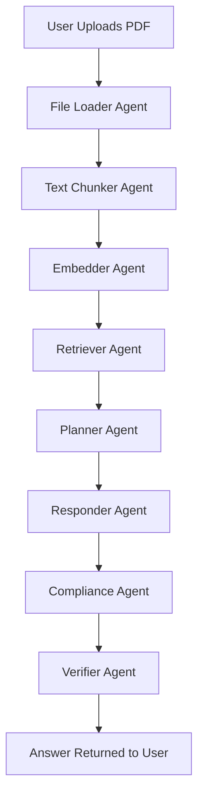

🧠 Agentic AI Orchestrator


 Multi-agent orchestration engine built with LangGraph, LangChain, FastAPI, and ChromaDB.
Modular. Scalable. Compliant. Document-aware


 
---

## 🧪 Overview

Agentic AI Orchestrator is a production-grade multi-agent engine enabling document-based RAG workflows with automated planning, response generation, and compliance validation. It leverages LangGraph DAGs to coordinate intelligent agents for PDF ingestion, QA, and policy checking — all through a single FastAPI endpoint.

---

## 📂 Project Structure

```bash
agentic-ai-orchestrator/
├── agents/                  # Specialized LangChain agents
│   ├── compliance.py        # Compliance Agent
│   ├── planner.py           # Planning Agent
│   ├── responder.py         # Response generation Agent
│   ├── retriever.py         # Vector Retriever
│   └── verifier.py          # Final answer verification
├── chains/                  # Custom LLM chains
├── graph/                   # LangGraph DAG definition
├── orchestrate.py           # Graph compilation logic
├── scripts/                 # Graph visualizer scripts
├── app/                     # FastAPI backend
├── test/                    # Unit/integration tests
└── README.md                # This file
```

| **Agent**           | **Role**                                                                 |
|---------------------|--------------------------------------------------------------------------|
| 🧭 **Planner**       | Decides execution flow and agents/tools to use                          |
| 🗣️ **Responder**     | Generates coherent LLM responses using context and intent                |
| 🔐 **Compliance**    | Applies policy/PII filters to prevent risky or non-compliant output      |
| 🔎 **Retriever**     | Fetches top-k document chunks from ChromaDB                             |
| ✅ **Verifier**       | Final step to verify answers are meaningful and integrity-safe          |

---

## ⚙️ Key Features

- ✅ PDF-first vector indexing with auto chunking
- 🧠 LangGraph multi-agent DAG orchestration
- 🧾 FastAPI + `curl`-ready backend
- 🔎 Contextual retrieval with ChromaDB
- 🔁 Composable and extensible workflow
- 🚨 Compliance guardrails with entity checkers

---

## 🚀 Quickstart

### 1. Install Dependencies

```bash
python -m venv .venv
source .venv/bin/activate
pip install -r requirements.txt
```

### 2. Run FastAPI Server

```bash
make run
# or
uvicorn app.main:app --reload
```

Visit: [http://localhost:8000/docs](http://localhost:8000/docs)

### 3. Hit Agent via `curl`

```bash
curl -X POST http://127.0.0.1:8000/run-agent \
  -H "accept: application/json" \
  -H "Content-Type: multipart/form-data" \
  -F "user_input=Summarize the key traits Amazon expects from its leaders" \
  -F "file=@path_to_file.pdf;type=application/pdf"
```

---

## 🌐 LangGraph DAG Visualization

> Requires `graphviz`:
> 
> `brew install graphviz` or `sudo apt install graphviz`

```bash
make graph        # ➜ creates graph_structure.dot
make view-graph   # ➜ generates graph.png and opens it
```

### 🧠 Agent Flow (Visual)



---

## 📦 Makefile Shortcuts

```bash
make install-deps     # pip install -r requirements.txt
make run              # Start the FastAPI app
make lint             # Lint the codebase
make format           # Format with black
make graph            # Generate graph_structure.dot
make view-graph       # Render and open graph.png
make gh-pr            # Raise PR to dev with GitHub CLI
```

---

## 🔐 .env Example

```bash
OPENAI_API_KEY=sk-...
CHROMA_COLLECTION_NAME=agentic_docs
```

---

## 📋 Roadmap

- ✅ MVP Completed
- 🔜 LangSmith tracing integration
- 🔜 Frontend RAG Viewer
- 🔜 HuggingFace / Azure provider abstraction
- 🔜 Postgres persistence for retrieved chunks

---

## 🤝 Contributing

We welcome PRs! Follow the naming pattern:

```bash
# Feature branches
new{ftr}/compliance-filter
```

---

## 🧾 License

MIT © 2025 Deval Thakkar
